# 각티슈 뽑듯 간편한 금리 비교 사이트 INTERESTing✨

## 1. 팀 구성 및 역할
### 구고운(팀장)
- PPT 발표
- 발표 자료 준비
- 회원가입, 로그인, 로그아웃, 회원 정보 수정 기능 구현
- User 닉네임, 캐시 추가 기능 구현
- 커뮤니티 CRUD 구현
- 가입 상품 담기 기능 구현
- 예금 API 연결
- 프로필, 커뮤니티, 메인 페이지, 내 근처 은행 찾기, 챗봇, 로그인, 회원가입, 환율 계산기, 주식 선물 CSS 디자인

### 홍성주
- 환율, 적금, 챗봇, 주식 API 연결
- 챗봇 추천 알고리즘 구현 
- 메인 페이지 CSS 디자인


## 2. 설계 구현
### 프로젝트 배경
⚓ [KEY POINT 1] 
사람들은 금융 상품을 너무 어려워한다.
한국인은 미국인과 대비해 주식 투자를 하는 사람이 적은 편이다.
접근성이 좋은 금리 비교 사이트가 있다면 더욱 간편한 세상이 되지 않을까?

⚓ [KEY POINT 2]
누구나 쉽게 선물을 주고 받는 시대,
주식을 선물할 수는 없을까?

### INTERESTing
금리(Interest Rate)를 흥미롭게(Interesting) 이용하는(~ing) 소비자를 위한 플랫폼 INTERESTing!


### ♟️예상 Sequence Diagram (경로)
- 예적금 비교 Sequence Digram
  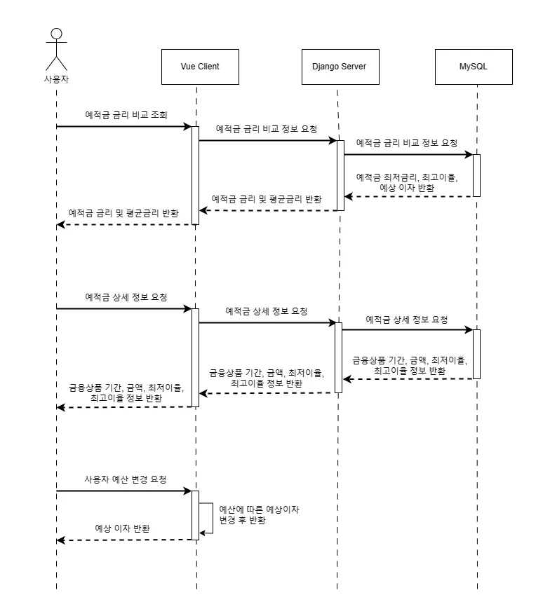
  - (완료) 예적금 금리 비교 조회 구현
  - (완료) 예적금 상세 정보 구현
  - (미완료) 사용자 예산 변경에 따른 예상 이자 반환

- 주식 선물 Sequence Digram

  - (완료) 주식 선물 메인페이지 조회 시 주식 정보 반환
  - (미완료) 주식 선물 페이지 요청시 구매 가능 여부 판단

### 🛠️ 기능 명세서 (외부)
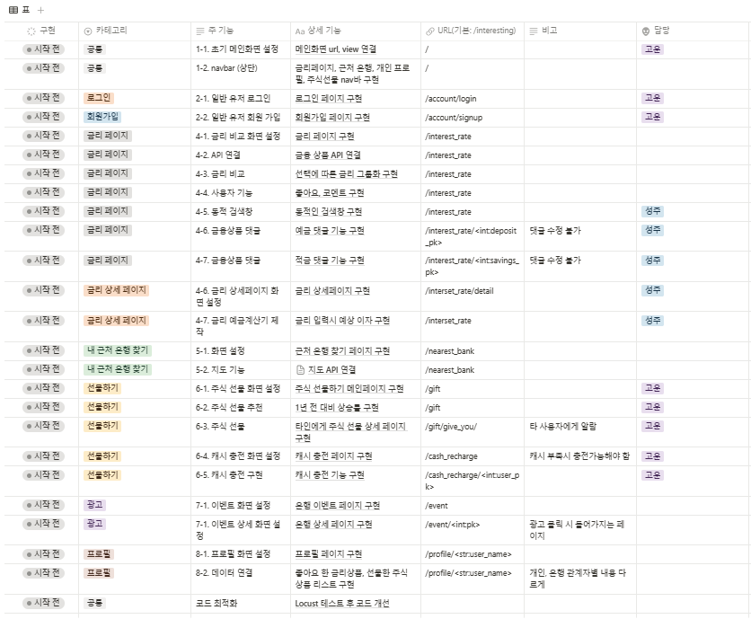

### 👀 API 명세서 (내부)
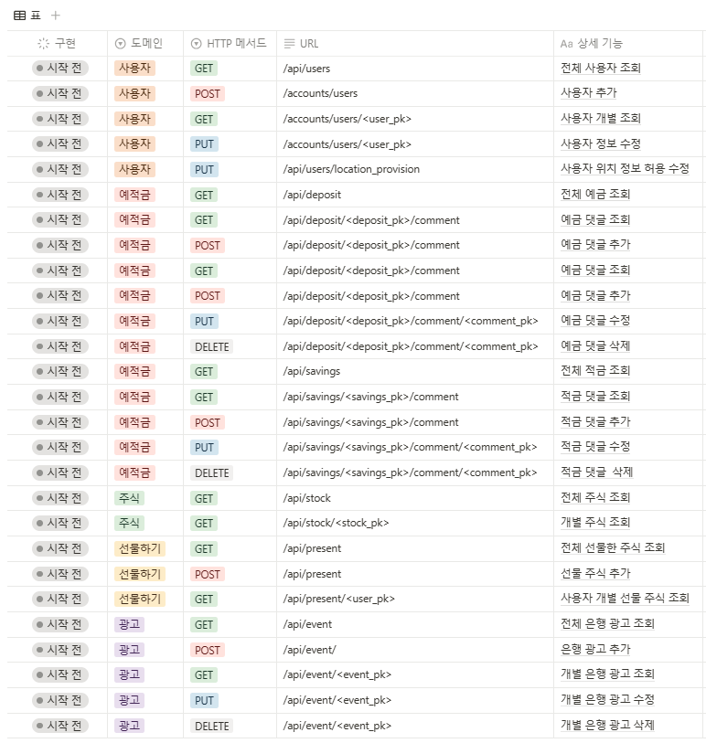

### 💝 기대 효과
- 고객: 각티슈 뽑듯이 편리하게 예적금 금리 비교, 주식 선물하기 가능
- 은행: 이벤트 페이지로 금융 상품 홍보 효과, 예적금 금리 리뷰(후기)로 우대 이율 이벤트 가능
- INTERESTing: 고객에게 경쟁력있는 금융 상품 추천 가능, 대한민국 국민에게 주식의 관심도 증가 기대

## 3. 데이터베이스 모델링(ERD)
- 구현 전 예상 ERD
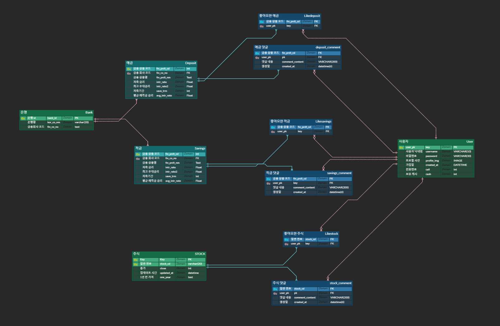
- 수정 ERD


---
## 4. OpenAI 챗봇을 활용한 금융 상품 추천 알고리즘
### 기능
- 사용자에게 입력값 받으면 javascript의 axios를 통해 요청된 Django 내부로 연결
- django 내부 view에서는 사용자의 입력값이 다음과 같이 처리된다.
  1.  pymysql을 사용해 MYSQL 활용
  2-1. 예적금 상품 정보 중 [상품번호(fin_prdt_cd), 은행이름(kor_co_nm), 상품이름(fin_prdt_nm), 우대조건(spcl_cnd)]
  2-2. 예적금 옵션 정보 중 [상품번호(fin_prdt_cd), 기간(save_trm), 기본금리(intr_rate), 최대금리(intr_rate2)]
  3. 가져온 데이터를 json 데이터로 재가공한다.
  4. AI 역할 지정 및 if, elif, else문을 활용해 사용자의 질문에 적절히 답할 수 있도록 구성
- 처리된 후 추출된 AI의 답변은 다시 프론트로 보내 Vue에 출력됨

### 💻 챗봇 코드 구성(Django의 view)
- 역할 지정
챗봇의 역할 지정. INTERESTing이 어떤 사이트 인지, 어떤 역할을 해야하는지 입력
  ```
  chat_history.extend(
        [
            {"role": "user", "content": f"{input_message}"},
            {"role": "system", "content": f"반드시 한글로 대답해줘. 너는 금리비교 사이트인 INTERESTing의 챗봇으로 사람들에게 추천 예적금을 알려줘야 해."}
        ] 
    )
    ```

- 필터링 및 프롬프트:
  1. ‘은행’과 ‘추천’을 같이 입력할 시 은행과 상품 추천을 함께, 추천이 아닌 은행만 물어본다면 은행 이름만 5개 추천하도록 구성
    - 코드
    ```
    if '은행' in input_message and '추천' in input_message:
        chat_history.append(
            {"role": "system", "content": f"만약 은행을 추천한다면 {product_info}에 기반해서 kor_co_nm와 fin_prdt_nm를 3개 추천해줘."}
        )
    elif '은행' in input_message:
        chat_history.append(
            {"role": "system", "content": f"만약 은행에 대해 물어보면 {product_info}의 kor_co_nm만 5개 정도 알려줘."}
        )
    ```
    - 은행 입력시 프롬프트
    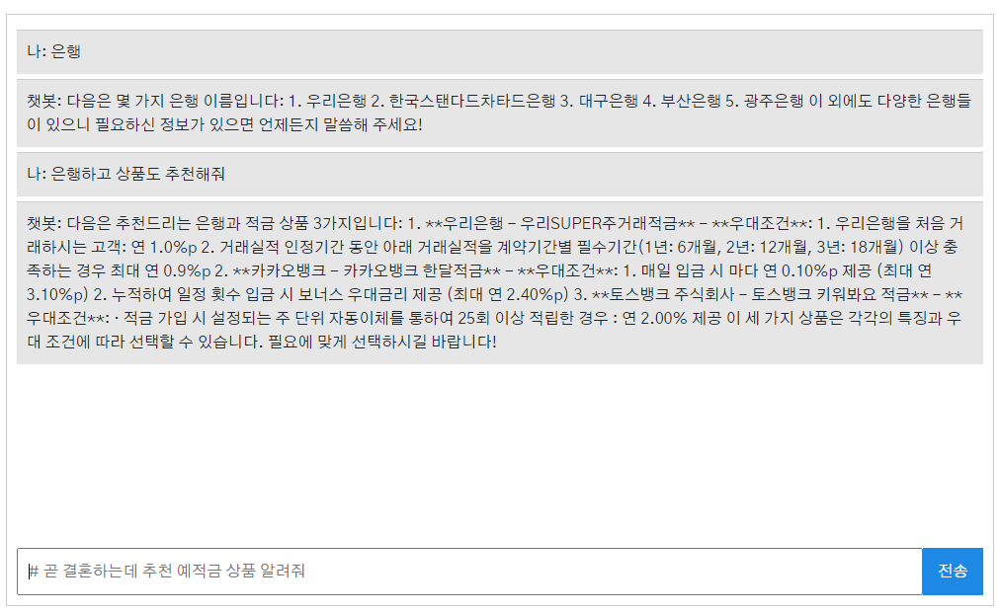

  2. ‘예금’과 ‘적금’을 같이 물어보면 3개 정도 추천, 예금과 적금 중 하나만 물어보았다면 해당 상품군 안에서만 3가지를 추천하도록 구성 
    - 코드
    ```
    if '예금' in input_message and  '적금' in input_message and '추천' in input_message:
        chat_history.append(
            {"role": "system", "content": f"만약 예금, 적금 상품을 추천한다면 {input_message}와 {product_info}의 spcl_cnd 정보에 기반해서 예금, 적금 상품을 합쳐서 3개 정도 추천해줘."}
        )
    elif '예금' in input_message and '추천' in input_message:
        chat_history.append(
            {"role": "system", "content": f"만약 예금 상품을 추천한다면 {input_message}와 {product_info}의 spcl_cnd 정보에 기반해서 예금 상품을 3개 정도 추천해줘. 적금은 추천해주면 안돼"}
        )
    elif '적금' in input_message and '추천' in input_message:
        chat_history.append(
            {"role": "system", "content": f"만약 적금 상품을 추천한다면 {input_message}와 {product_info}의 spcl_cnd 정보에 기반해서 적금 상품을 3개 정도 추천해줘. 예금은 추천해주면 안돼" }
        )
    ```
    - 예금, 적금 추천시 프롬프트
    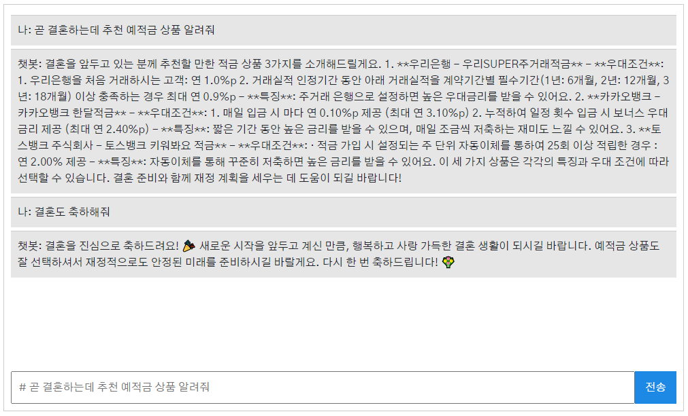
  3. 금리를 물어봤을때 아직 금융상품을 고르지 않았다면 상품명을 다시 물어보도록 구성
    ```
    if '금리' in input_message:
    chat_history.append(
        {"role": "system", "content": f"만약 금리를 물어봤는데 금융상품인 fin_prdt_nm를 선택 안했다면 어떤 상품으로 조회할지 먼저 물어봐 줘. fin_prdt_nm를 선택했다면 {deposit_info}에 기반해서 물어본 savings_info의 최저금리 intr_rate와 최고금리 intr_rate2를 알려줘."}
    )
    ```
    - 금리 입력시 프롬프트
    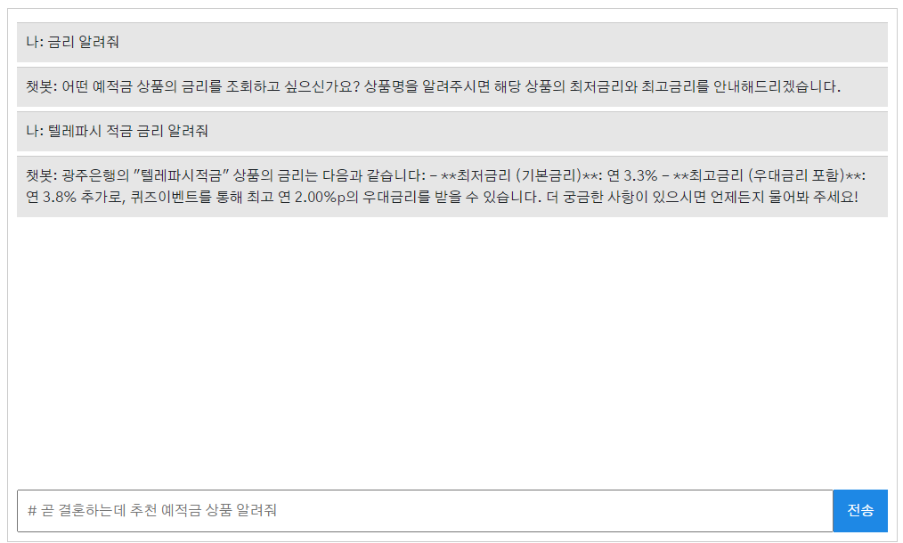

- AI 추천 기술 구현:
  - 결혼, 청년, 학생 등 여러 조건을 가진 사용자를 조건문으로 나누기에는 오랜 시간이 소요된다.
  - 가장 AI가 효율적으로 판단하기 위한 방법을 고민했고, 우대조건 데이터를 불러오며 해결했다. 우대조건에는 여행적금 가입자, 에너지 절감, 청년 응원 우대 등 상품의 특징이 뭍어나 있어 AI의 효율적인 판단이 가능해졌다.

## 5. 서비스 대표 기능 설명
### 메인 페이지
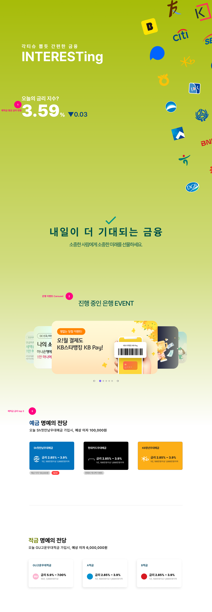
- 예금, 적금 TOP3 상품 소개
  - 전체 예적금 데이터 중 최고금리가 가장 높은 금융 상품 노출
  - 가장 높은 금리 상품으로 가입할 시 받을 수 있는 이자 출력
  

### 회원 커스터마이징
- allauth 회원 관리 라이브러리를 사용해 구성
- 필드 구성: 아이디, 닉네임, 이메일, 가입한 상품 목록
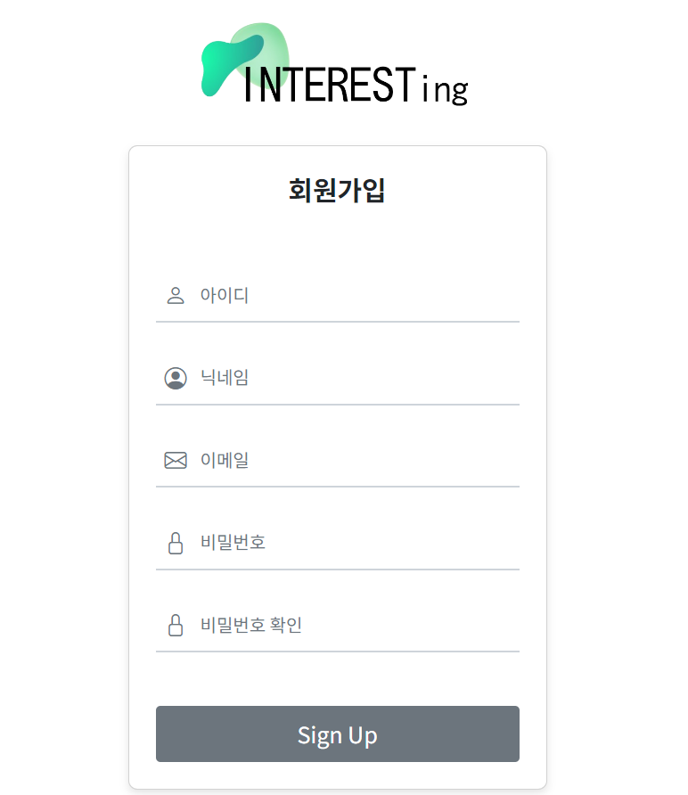


### 예적금 금리 비교
   **1. 데이터 저장**
  - 금융감독원의 금융상품비교공시 API를 활용해 예적금 데이터 저장
  - 상품에 정보가 없는 부분이 중간중간 있으니  model에서 black=True, null=True를 적절히 배치
  ```
  # models.py의 적금 옵션
  class OptionList(models.Model):
      financial_product = models.ForeignKey(FinancialProduct, related_name='options', on_delete=models.CASCADE)
      fin_prdt_cd = models.CharField(max_length=50)                       # 금융 상품 코드
      rsrv_type = models.CharField(max_length=1, null=True)               # 적립 유형
      rsrv_type_nm = models.CharField(max_length=20, null=True)           # 저축 유형명
      save_trm = models.CharField(max_length=3)                           # 저축 기간(개월)
      intr_rate = models.FloatField(blank=True, null=True)                # 저축금리
      intr_rate2 = models.FloatField(blank=True, null=True)               # 최고 우대금리
  ```
  - 이미 있는 데이터는 저장되지 않도록 view에서 처리
  ```
  # views.py에서 겹치는 필드 제외
          if FinancialProduct.objects.filter(fin_prdt_cd=li['fin_prdt_cd']).exists():
              continue
          product_serializer = SavingsProductsSerializer(data=save_data)
          # 유효성 검증
          if product_serializer.is_valid(raise_exception=True):
              # 유효하다면 저장
              product = product_serializer.save()
  ```
  **2. 전체 조회**
  
  - 예적금 상품에서 전체 기간 중 가장 최저 금리와 최대 금리로 출력되도록 구성
  - 그 중 최고금리를 기준으로 내림차순 정렬되도록 함


### 환율 계산기
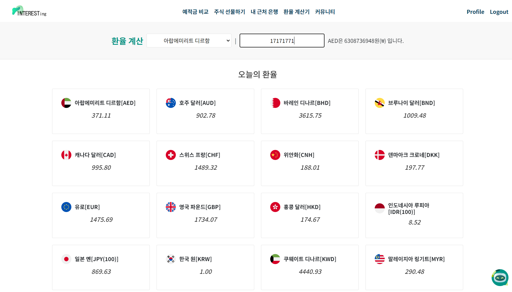
- 한국수출입은행 환율정보 API를 활용해 환율 데이터 저장
- 국가를 선택해 원화로 환전시 얼마인지 제공
- input에 v-model을 연결해 환율 바로 출력되도록 함
```
<!-- template -->
<input type="text" v-model.number="amount" placeholder="환전할 금액">{{ selectedExchange?.cur_unit }}은 {{ calculateResult }}원(₩) 입니다

<!-- script -->
// 환율 계산 함수
const calculateResult = computed(() => {
    if (selectedExchange.value) {
        console.log(selectedExchange.value.id)
        const exchangeRate = (selectedExchange.value.id === 12 || selectedExchange.value.id === 13) ? parseFloat(selectedExchange.value.ttb) / 100 : parseFloat(selectedExchange.value.ttb)
        return Math.round(amount.value * exchangeRate)
    }
    return 0
})
```

### 근처 은행 검색
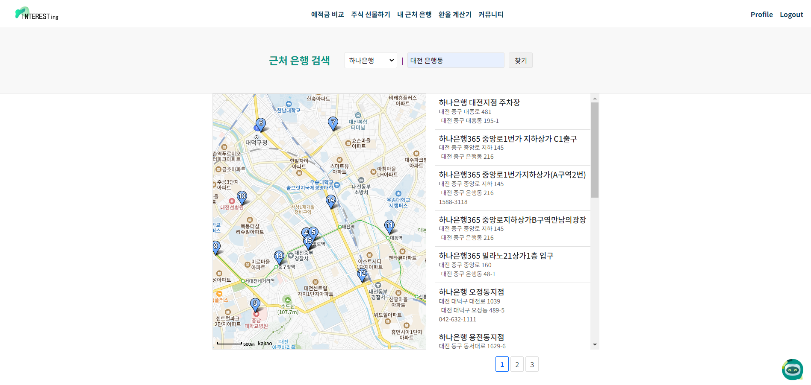
- 카카오맵 API를 활용해 지도 데이터 요청
- 은행과 근처 지역 입력값을 따로 받되, 검색시 내부에서는 이 두 값을 합쳐 API 요청

```
<!-- template -->
<div class="m-4">
    <select v-model="result" id="keyword" class="custom-border">
      <option value="" selected disabled>은행 선택</option>
      <option v-for="(bank, index) in banks" :key="index" :value="bank">
      {{ bank }}
      </option>
    </select>  |  
    <input type="text" id="region" size="20" placeholder="내 근처 지역 입력" class="custom-border" />
    <button @click="searchPlaces" class="custom-border">검색하기</button>
</div>
<!-- script -->
  const query = keyword + ' ' + region; // 지역 정보를 은행와 합침

  this.ps.keywordSearch(query, this.placesSearchCB.bind(this)); // 합친 쿼리로 검색 수행
```

### 주식 커뮤니티(게시판)
- 글 목록
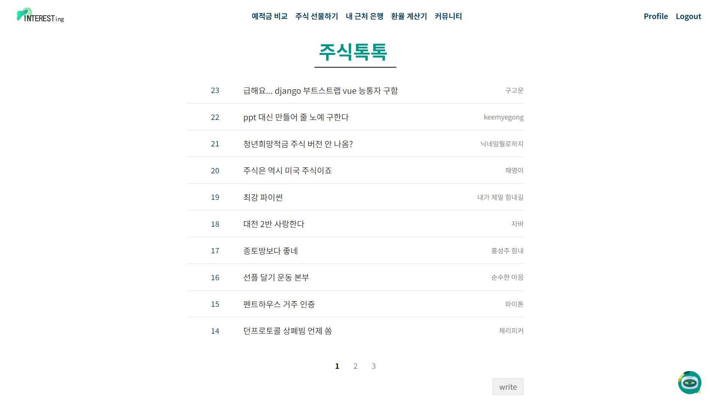  
- 게시글 및 댓글
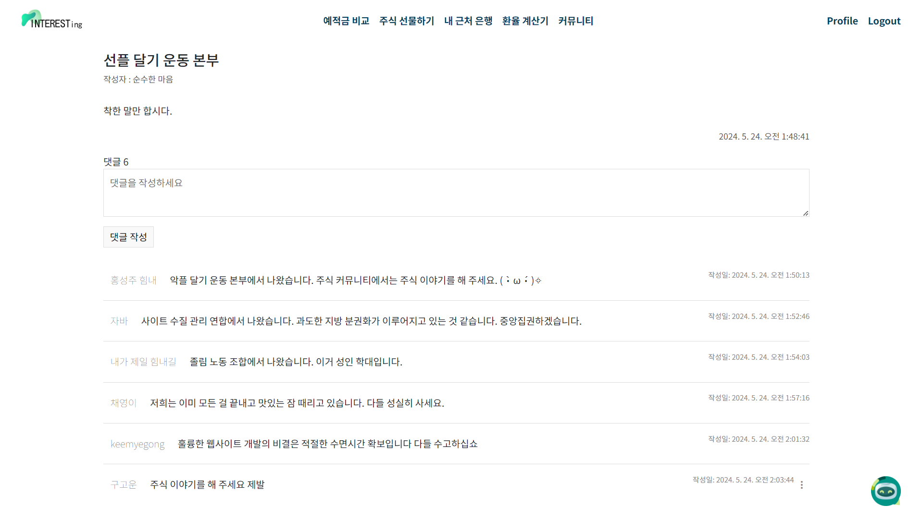
- 
- 
- 

### 프로필 페이지  (수정필요)
-
-


## 6. 후기
### 고운: (수정)

### 성주
- 항상 API 연결에 대한 두려움이 있었는데 이번 기회에 계속 연습하며 프론트 Vue부터 백 Django까지, Django 부터 MYSQL까지 어떻게 연결이 되는지 이해하는 시간이 되었습니다.
- 특히 챗봇을 만드는 과정에서 뷰에서 받은 입력값에 MYSQL데이터를 참조할 수 있도록 AI를 훈련시키는 과정이 굉장히 흥미로웠습니다. pymysql이라는 좋은 패키지를 활용해 데이터를 db에 따로 저장하고, 이를 if문으로 간단하게 AI를 훈련시킬 수 있었습니다. 기회가 된다면 OpenAI API로 다른 추천 서비스도 구현하고 싶다는 목표가 생겼습니다.
- 여러 기능들을 일주일안에 구현하느라 완벽한 기능 구현과 시간 분배에 대한 아쉬움도 있지만 이번 프로젝트 경험을 밑거름 삼아 더 성장하는 개발자가 되겠습니다!


